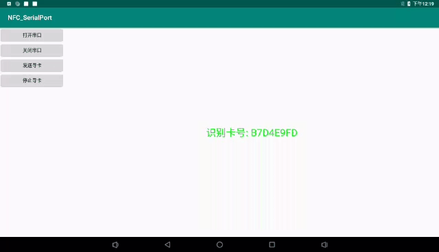
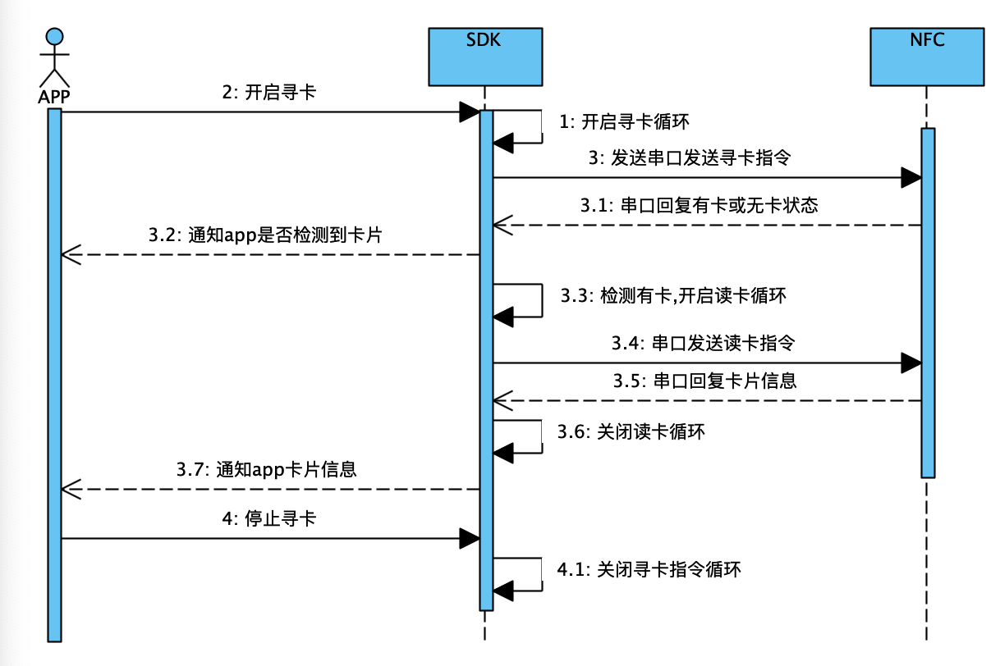

# NFC读卡器
主要用于串口NFC读取卡片信息(非接触式 IC卡)
## 效果展示
<p align="center">
	
	<p align="center">
		<em>效果展示</em>
	</p>
</p>
## 读卡原理
<p align="center">
	
	<p align="center">
		<em>流程图</em>
	</p>
</p>

## 功能介绍
1. 新开进程处理NFC相关数据,有效避免发生异常时主进程意外崩溃
2. 实时监测NFC模块有无卡状态
3. NFC模块信息读取结果通知

## 简单使用
### 1.引入
为了方便修改串口配置和NFC解析逻辑,这里采用本地库的形式
```
    implementation project(path: ':lib_nfc')
```


### 2.初始化

```
   NFCManager.get().init(this);
   NFCManager.get().setNfcManagerListener(new OnNFCManagerListener() {
                    @Override
                    public void hasCard(boolean hasCard) {

                    }

                    @Override
                    public void getCardNumber(String number) {

                    }
                });
```
调用后会自动打开串口并初始化NFC相关模块
### 3.开启寻卡

```
   NFCManager.get().openFindCard();
```
调用后开始发送寻卡指令,并通过接口通知回调

```
@Override
   public void hasCard(boolean hasCard) {
   }
```

### 4.读卡通知
SDK在寻卡功能开启时,默认开启读卡功能,因此当有卡时不需要任何操作就可以直接获取卡号,并通过相关接口回调

```
    @Override
       public void getCardNumber(String number) {}
```
获取卡号后就可以处理自己的业务了

### 5.停止和退出
不需要使用时,发送停止寻卡指令就好

```
  NFCManager.get().stopFindCard();
```
退出程序时及时释放资源

```
 NFCManager.get().release(this);
```


## 支持手动读卡
SDK默认开启自动读卡当然也可以手动读卡,不过开启手动读卡后就需要自己处理读卡逻辑了

```
    NFCManager.get().init(this).setAutoGetNumber(false);
```
具体使用查看demo

## 注意点
1. 由于本SDK使用了多进程,为了避免在application中在初始化多次的问题,可以在init之前判断当前进程是否是主进程,或者直接在主Activity中初始化
2. 本库采用SerialPort串口库,读操作是放在ReadThread通过read阻塞读取的,sdk虽然中断了该thread的标志位,但循环依然阻塞不会释放,需要修改SerialPort源码,因此不要避免频繁开关串口